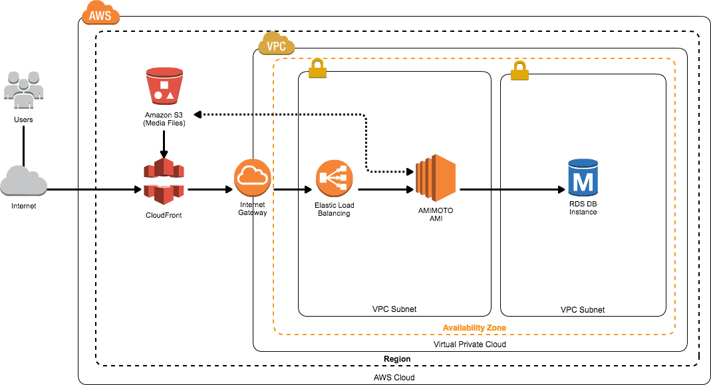

# Start up JINKEI

Architecture

## Outline

- WordPress Powered by AMIMOTO (Apache HTTPD PHP7) on AWS Marketplace : https://aws.amazon.com/marketplace/pp/B01B3ZE1NC/
- Choose [WordPress powered by JINKEI (Simple Stack MOD_PHP)] in [Delivery Methods]
- Enter the information in accordance with the setup wizard.

## Detail informations
https://ja.amimoto-ami.com/support/how-to-use/cloudformation-jin-kei/
