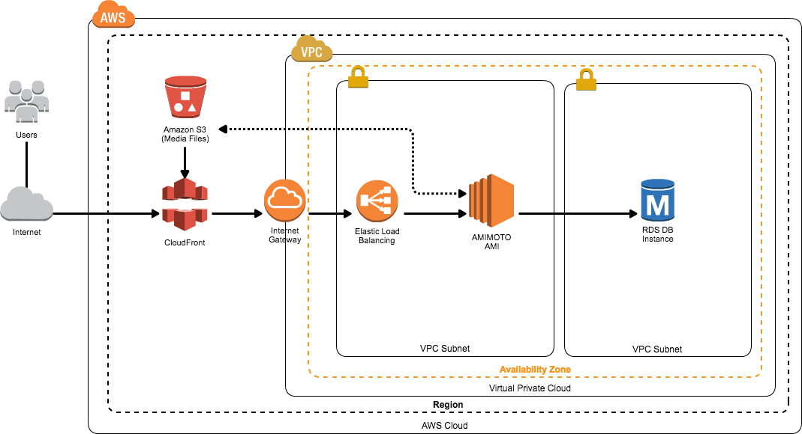
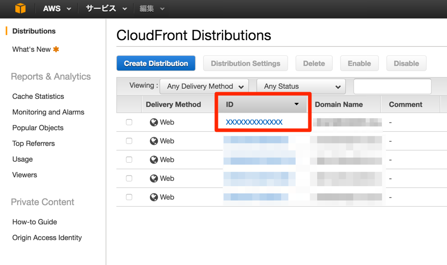

# JIN-KEI Simple Stackを作る

作る構成図

## この構成図で実現できること
- RDSを使うことで耐障害性を向上
- CloudFrontでコンテンツの配信を高速化
- S3を使った低コストメディアストレージ

## 事前準備
- AMIMOTO AMIでEC2をセットアップしてください(WordPressのインストールまで必要です)
- AWS CLIを使用しますので、これからセットアップします
- CloudFrontをAWS CLIから使用する準備も必要です

### AMIMOTO AMIでEC2をセットアップしてください
- ハンズオン最中にDBの切り替えなどを行いますので、本番環境は絶対に使わないでください
- WooCommerce Powered by AMIMOTO (Apache HTTPD PHP7) on AWS Marketplace : https://aws.amazon.com/marketplace/pp/B01DAONMCK/
- AMI料金は14日間無料（EC2インスタンス料金は必要）です

###AWS CLIのセットアップ
aws-cli のインストール方法は二通り:

- AWS ユーザガイドページの手順で行う: 
http://docs.aws.amazon.com/cli/latest/userguide/installing.html
- Mac の場合は パッケージマネージャの Homebrew を使ってインストールをする: 
http://brew.sh/index.html

####Homebrewからセットアップする
以下のコマンドをターミナルへ入力します
```
- /usr/bin/ruby -e "$(curl -fsSL https://raw.githubusercontent.com/Homebrew/install/master/install)"
- brew install wget
- brew install awscli
```
#### Windowsにインストールする
- Download the AWS CLI MSI installer for Windows (64-bit):https://s3.amazonaws.com/aws-cli/AWSCLI64.msi
- Download the AWS CLI MSI installer for Windows (32-bit):https://s3.amazonaws.com/aws-cli/AWSCLI32.msi

デフォルトでは以下のディレクトリに展開されます

- `C:\Program Files\Amazon\AWSCLI` (64-bit)
- `C:\Program Files (x86)\Amazon\AWSCLI` (32-bit)

###AWS CLIを動かすためのIAM設定
AWS CLIを動かすにはクレデンシャル（認証情報）が必要です。
ここからはIAM (AWS Identity and Access Management) を使ってAWS CLIのための認証情報を取得します。

####AWSコンソールからIAMのページへ移動
https://console.aws.amazon.com/iam/home#home

####ユーザーを作成
1. 左メニューの「Users」をクリック
2. 「Create News Users」をクリックしてウィザードを起動
3. 「Enter User names:」に「amimoto-cli」と入力
AWS CLIのためのIAMユーザであることをわかるようにしましょう
4. 「Generate an access key for each user」のチェックをオンにする
5. 作成します

####クレデンシャルを保存
- Access Key ID
- Secret Access Key

この２つを手元に控えてください。（CSVでダウンロード可能）
この画面を閉じると２度と見れませんので、紛失した場合は再発行となります。

####AWS CLIの初期設定
```
aws configure --profile amimoto-cli
```

#####設定する値
以下の値を対話式で入力します

- クレデンシャル
- デフォルトリージョン
- 実行結果を表示するフォーマット

```
AWS Access Key ID [None]: xxxxxxxxxx
AWS Secret Access Key [None]: xxxxxxxxxx
Default region name [None]: ap-northeast-1
Default output format [None]: json
```

### CloudFrontをAWS CLIから使用する準備
通常のAWS CLIではCloudFrontが利用できないため、有効化させます
```
$ aws --profile amimoto-cli configure set preview.cloudfront true
## 動作確認
$ aws --profile amimoto-cli cloudfront help
```

## AMIMOTOにCloudFrontを追加する
CloudFrontを使うことで・・・

- 世界各地にあるAWSのもつCDNサーバを使える
- CDNを用いることでサイトの高速化とサーバ負荷削減を同時実現
- エラーレスポンスのカスタマイズが可能なので、サーバ障害時にも強くなる

### セットアップコマンド

- ORIGIN URLをAMIMOTOサーバのドメイン名（パブリックDNS）に書き換えます。
- profile名を「`amimoto-cli`」以外にしている方は、「`--profile amimoto-cli`」の部分を変更する必要があります。
```
$ export origin_url='{ORIGIN URL}'; aws --profile amimoto-cli cloudfront create-distribution --cli-input-json "$(curl -l -s https://raw.githubusercontent.com/amimoto-ami/create-cf-dist-settings/master/source_dist_setting.sh?a | sh)"
```
#### パブリックDNSがない場合
http://qiita.com/kasokai/items/4ea689ce9f206e78a523

### セットアップを待ちます
CloudFrontが立ち上がるまで２０〜３０分程度かかります。
待機している間にRDSとS3のセットアップを進めましょう。

## AMIMOTOにS3を追加する
### S3を使うメリット
- 低コストでメディアストレージを使える
- 冗長化されて保存されるので、障害に強い
- ファイル数・容量に上限なし

### セットアップ手順
1. IAMを準備
2. バケットを作成
3. バケットの設定
4. WordPressプラグインのセットアップ

#### IAMを準備
##### IAMユーザーを作成
1. 管理画面からIAMにアクセス
2. 左メニューの「Users」をクリック
3. 「Create News Users」をクリックしてウィザードを起動
4. 「Enter User names:」に「amimoto-s3」と入力
-- S3のためのIAMユーザであることをわかるようにしましょう
5. 「Generate an access key for each user」のチェックをオンにする
6. 作成します

##### IAMユーザーにポリシーを設定
1. 左メニューの「Users」をクリック
2. 「amimoto-s3」をクリック
3. 「Permissions」をクリック
4. 「Managed Policies」の枠内にある「Attach Policy」をクリック
5. 「AmazonS3FullAccess」を選択して「Attach Policy」をクリック

#### バケットを作成
1. 管理画面からS3にアクセス
2. 「Create Bucket」をクリック
3. 「Bucket Name」に任意の名前をいれます
-- Note: すでに誰かが使っているバケット名は利用できません
4. 「Region」を選択します
5. 「Create」をクリックして作成します

#### バケットの設定
1. S3のリストから先ほど作成したバケット名を選択します
2. 画面右上「Properties」をクリックします
3. 「Static Website Hosting」をクリックします
4. 「Endpoint」を控えます
5. 「Enable website hosting」を選択します
6. 「Index Document」に「index.html」を入力します
7. 「Save」を選択します


## AMIMOTOにRDSを追加する
RDSを使用することで・・・

- 管理の簡単なDBサーバを簡単に使える
- DBのレプリケーションやスペック変更が１クリックで実現可能
- MySQL / MariaDB / Amazon Auroraなど、様々なエンジンを使える

### RDSをセットアップする
1. AWS管理画面へアクセス
2. RDSのアイコンをクリック
3. 「Instance」から「Launch DB Instance」をクリック
4. DBエンジンを選択（MariaDBを推奨）
5. Amazon Auroraを勧められますが、お金に余裕がないなら避けましょう

### RDSの初期設定
「Specify DB Details」という画面でDBの初期設定を行います

####「Settings」に入れる値

|項目名|入れる値|
|:--|:--|
|DB Instance Identifier|DBインスタンス名|
|Master Username|DBのルートユーザー名|
|Master Password|DBのルートユーザーパスワード|
|Confirm Passoword|パスワードの確認|

DBに接続する際に必須の値ですので、手元にメモしておきましょう。
その他の設定は（ハンズオンでは）特に変更しなくてOKです。

#### 「Configure Advanced Settings」でDB名を設定する
「Database Name」という項目に入れた値がDB名になりますので、これも控えておきましょう。

##### こんなイメージです
```
$ mysql -u {Master Username} -p{Master Password} {Database Name}
```

#### RDSを作成します
作成には少し時間がかかります。
今の間に一息いれましょう。

左メニュー「Instance」をクリックして「DB Instance Identifier」と同じ名前の「DB Instance」を探してください。
一致するものの「Status」が「available」になっていればOKです。

#### セキュリティグループを設定
1. セキュリティグループの設定を変更します
2. 「Edit Security Group」をクリックする
3. 「Inboud」タブをクリックする
4. 「Add Rule」をクリックする
5. 「Type」を「MySQL/Aurora」に設定する
6. 「Source」は「Anywhere」を選択する
-- 可能な方はAMIMOTO AMIのIP（XX.XXX.XXX.XX/0）にしてみてください
7. 「Save」をクリック

### AMIMOTOのDB情報をRDSに接続する
#### AMIMOTOにSSH接続
AMIMOTOのインスタンスにSSHで接続してください。
```
$ ssh -i /path/to/pem/{PEMFILENAME}.pem ec2-user@{INSTANCE_IP}
```

#### wp-config.phpを編集
```
$ sudo su -
# cd /var/www/vhosts/{INSTANCE_ID}
# vim local-config.php
```

#### 書き換える場所
local-config.php (Line: 13-16)

```
if ( !$db_data ) {
         $db_data = array(
                'database' => '{Database Name}',
                'username' => '{Master Username}',
                'password' => '{Master Password}',
                'host'     => '{RDS_ENDPOINT}',
        );
}
```

##### vimを使う場合・・・

|コマンド|できること|
|:--|:--|
|[esc]|ノーマルモード|
|:set number|行数表示|
|[shift]+[z]２回|保存して終了|
|i|編集モード|

#### 接続を確認
AMIMOTOのサイトにアクセスして、「データベース接続エラー」が表示されていないことを確認します。

#### EC2のMySQLを停止する
```
# exit
$ vim /opt/local/amimoto.json
```
以下のように「`"mysql": { "enabled": false },`」を追加します。
##### Before
```
{
"mod_php7" : { "enabled": true },
"run_list" : [ "recipe[amimoto]" ]
}
```

###### After
```
{
"mod_php7" : { "enabled": true },
"mysql": { "enabled": false },
"run_list" : [ "recipe[amimoto]" ]
}
```

##### Run Command
```
$ sudo /opt/local/provision
```

#### WordPressプラグインを入れる
1. WordPress管理画面にログインします
2. Nephila Clavata(絡新婦)プラグインを有効化します
3. 「Settings > Nephila Clavata」からS3の設定を行います

|項目名|入れる値|
|:--|:--|
|AWS Access Key|amimoto-s3のAWS Access Key|
|AWS Secret Key|amimoto-s3のAWS Secret Key|
|AWS Region|S3バケット作成時に指定したリージョン|
|S3 Bucket|作成したS3バケットの名前|
|S3 URL|S3バケットの「Endpoint」|
|Storage Class|STANDARD|

## CloudFrontの最終設定
最後にCloudFrontをWordPressで便利に使う設定を行います。

### 設定手順
- IAMを準備
- WordPressプラグインのセットアップ

#### IAMを準備
##### IAMユーザーを作成
1. 管理画面からIAMにアクセス
2. 左メニューの「Users」をクリック
3. 「Create News Users」をクリックしてウィザードを起動
4. 「Enter User names:」に「`amimoto-cloudfront`」と入力
-- CloudFrontのためのIAMユーザであることをわかるようにしましょう
5. 「Generate an access key for each user」のチェックをオンにする
6. 作成します

##### IAMユーザーにポリシーを設定
1. 左メニューの「Users」をクリック
2. 「amimoto-cloudfront」をクリック
3. 「Permissions」をクリック
4. 「Managed Policies」の枠内にある「Attach Policy」をクリック
5. 「CloudFrontFullAccess」を選択して「Attach Policy」をクリック

#### WordPressプラグインのセットアップ
##### キャッシュ削除プラグイン
1. WordPress管理画面にログインします
2. C3 CloudFront Clear Cacheプラグインを有効化します
3. 「Settings > C3 Settings」からCloudFrontの設定を行います

|項目名|入れる値|
|:--|:--|
|CloudFront Distribution ID|CloudFrontのディストリビューションID|
|AWS Access Key|amimoto-cloudfrontのAWS Access Key|
|AWS Secret Key|amimoto-cloudfrontのAWS Secret Key|

##### CloudFrontのディストリビューションID確認方法

